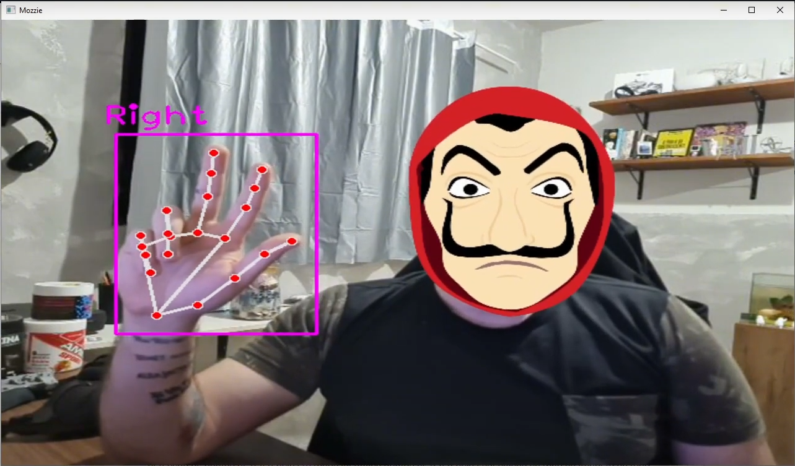
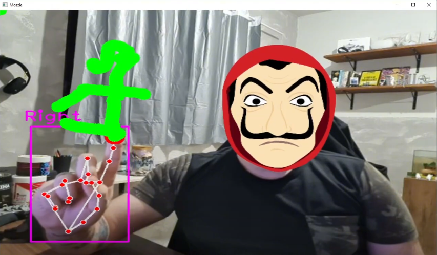

<div align="center">
    <h1 id="titulo">OpenCV-Facial-Hand-Detection</h1>
    <p>A Python project using OpenCV for facial recognition and hand detection, enabling real-time interactive drawing and image overlay capabilities.</p>
</div>

## Language / Língua

1. [English](#english)
2. [Português](#português)

---

## English

1. [Overview](#overview)
2. [Installation](#installation)
3. [How to Use](#how-to-use)
4. [Examples](#examples)
5. [Contributing](#contributing)
6. [License](#license)

### Overview

This project utilizes Python and the OpenCV library to create an interactive application that combines facial recognition and hand detection. You can draw on-screen using hand gestures and apply image overlays on detected faces from the camera feed.

### Installation

1. Clone the repository:

    ```bash
   git clone https://github.com/MozzieGM/OpenCV-Facial-Hand-Detection.git
2. Install the required dependencies:

    ```bash
    pip install opencv-python numpy cvzone
3. Download the `overlay.png` file and save it in the project's root directory.

### How to Use

1. Run the main script:

    ```bash
   python main.py
2. The program will open a window showing the live camera feed.
3. Interact with the program using hand gestures to draw or apply image overlays on detected faces.

### Examples





*Description: Drawing made using hand gestures.*

### Contributing

Contributions are welcome! For suggestions, open a detailed issue or submit a pull request with your changes.

### License

This project is licensed under the [MIT License](LICENSE).


---

## Português

1. [Visão Geral](#visao-geral)
2. [Instalação](#instalacao)
3. [Como Usar](#como-usar)
4. [Exemplos](#exemplos)
5. [Contribuindo](#contribuindo)
6. [Licença](#licenca)

### Visão Geral

Este projeto utiliza Python e a biblioteca OpenCV para criar uma aplicação interativa que combina reconhecimento facial e detecção de mãos. Você pode desenhar na tela usando gestos com as mãos e aplicar sobreposições de imagem em rostos detectados no feed da câmera.

### Instalação

1. Clone o repositório:

    ```bash
   git clone https://github.com/MozzieGM/OpenCV-Facial-Hand-Detection.git
2. Instale as dependências necessárias:

    ```bash
    pip install opencv-python numpy cvzone
3. Baixe o arquivo `overlay.png` e salve-o no diretório raiz do projeto.

### Como Usar

1. Execute o script principal:

    ```bash
   python main.py
2. O programa abrirá uma janela mostrando o feed da câmera ao vivo.
3. Interaja com o programa usando gestos das mãos para desenhar ou aplicar sobreposições de imagem nos rostos detectados.

### Exemplos


*Descrição: Desenho feito usando gestos com as mãos.*

### Contribuindo

Contribuições são bem-vindas! Para sugestões, abra um problema detalhado ou envie um pull request com suas alterações.

### Licença

Este projeto está licenciado sob a [MIT License](LICENSE).

